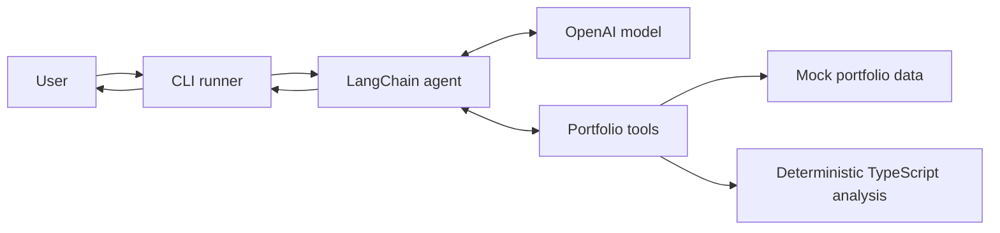

# Architecture

> Keep the architecture documentation current whenever data flow, tools, services, external integrations, persistence, deployment, or infrastructure change. Update the relevant detailed page in the same code change.

## What The Application Does

The application reads fictional portfolio data, calculates portfolio facts with deterministic TypeScript code, and asks an AI agent to turn those facts into a short market-close brief.

## Current System Overview



This diagram shows the major application boundaries. It intentionally groups the tools and analysis modules so the overall system remains readable.

## Architecture Details

- [Agent Runtime](docs/architecture/agent-runtime.md) explains how one request moves through the CLI, model, LangGraph-powered tool loop, and final response.
- [Tool Layer](docs/architecture/tool-layer.md) explains each portfolio tool, its inputs and outputs, and its data and analysis dependencies.

## Main Responsibilities

- `src/index.ts` starts one run and prints the result.
- `src/agents/portfolioBriefAgent.ts` configures the model, instructions, safety rules, and available tools.
- `src/tools/` exposes bounded capabilities to the model through LangChain and Zod schemas.
- `src/analysis/` owns deterministic calculations, filtering, sorting, and risk classification.
- `src/data/` provides fictional data while no external provider is connected.
- `src/domain/` defines provider-neutral TypeScript contracts.
- `src/schemas/` provides runtime validation for data crossing trust boundaries.

## Most Important Design Rule

The AI does not own financial arithmetic.

```text
TypeScript code: calculate facts
AI agent: explain facts
```

This keeps important values testable and repeatable. The agent should not independently calculate values that normal code can calculate more reliably.

## Current Temporary Compromises

The CLI sends only user intent, so portfolio facts flow through tools rather than through the prompt. However, every local tool currently imports the same immutable mock snapshot independently.

This is acceptable for fictional local data. A live provider could return different snapshots across separate calls, so the future provider boundary must fetch once per run or otherwise guarantee one consistent snapshot.

Model construction and provider selection remain inside the agent module. A later configuration boundary will centralize model and environment setup.

The runtime `PortfolioBrief` schema is being developed but has not yet been connected to the agent's final output.

## Planned Growth

1. Connect and enforce the Zod portfolio-brief schema in agent output.
2. Introduce a reusable configuration and provider boundary.
3. Add LangSmith traces and evals.
4. Replace mock data with a read-only MCP connection.
5. Express the workflow as an explicit LangGraph.
6. Add notifications, scheduling, CI, Docker, and VM deployment.

## Update Checklist

When the architecture changes:

- Update this overview when a major system boundary changes.
- Update `agent-runtime.md` when invocation, orchestration, model, output, memory, or scheduling behavior changes.
- Update `tool-layer.md` when tools, data providers, schemas, or deterministic analysis dependencies change.
- Confirm there is one clear source for each kind of data.
- Keep calculations outside the AI model.
- Add tests for new deterministic behavior and external boundaries.
- Document new external services and safety boundaries.
