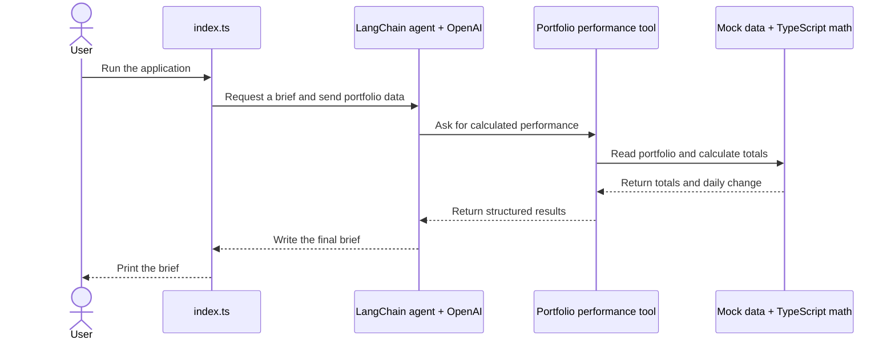

# Architecture

> Keep this file current. Whenever we change how data moves through the application, add a tool or service, connect an external system, or change deployment, update this diagram in the same code change.

## What The Application Does

The application reads fictional portfolio data, calculates performance with normal TypeScript code, and asks an AI agent to turn those facts into a short portfolio brief.

## Current Flow



Read the diagram from top to bottom. Each arrow is one piece of information moving to the next part of the application.

## Main Pieces

| File | Plain-language responsibility |
| --- | --- |
| `src/index.ts` | Starts the application, asks the agent for a brief, and prints the answer. |
| `src/agents/portfolioBriefAgent.ts` | Defines the agent's model, instructions, safety rules, and tools. |
| `src/tools/getPortfolioPerformance.ts` | Gives the agent access to trusted portfolio calculations. |
| `src/analysis/portfolioMath.ts` | Calculates totals and daily changes using normal TypeScript. |
| `src/data/mockPortfolio.ts` | Holds fictional portfolio data while the real provider is not connected. |
| `src/domain/portfolio.ts` | Defines the shapes of holdings, snapshots, calculations, risks, and briefs. |
| `src/analysis/portfolioMath.test.ts` | Checks that the TypeScript calculations are correct. |

## Most Important Design Rule

The AI does not own financial arithmetic.

```text
TypeScript code: calculate facts
AI agent: explain facts
```

This makes important values testable and repeatable. The agent should not independently calculate totals that normal code can calculate more reliably.

## Current Temporary Problem

The mock portfolio is currently read twice:

1. `index.ts` sends it to the agent as part of the request.
2. The performance tool reads it again to calculate totals.

These two reads use the same data today, but they could disagree in the future. The next step adds a `get_portfolio_snapshot` tool and removes portfolio data from `index.ts`. The tools will then become the one trusted path to portfolio data.

## Planned Growth

The architecture will expand gradually:

1. Establish one portfolio-data path through tools.
2. Add tested tools for movers, concentration risk, and events.
3. Validate the final brief with Zod.
4. Add LangSmith traces and evals.
5. Replace mock data with a read-only MCP connection.
6. Express the workflow in LangGraph.
7. Add notifications, scheduling, CI, Docker, and VM deployment.

## Update Checklist

When the architecture changes:

- Update the diagram.
- Add or remove files from the responsibility table.
- Confirm there is one clear source for each kind of data.
- Keep calculations outside the AI model.
- Add tests for new deterministic behavior.
- Document new external services and safety boundaries.
