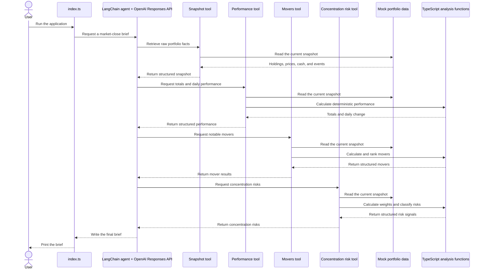

# Architecture

> Keep this file current. Whenever we change how data moves through the application, add a tool or service, connect an external system, or change deployment, update this diagram in the same code change.

## What The Application Does

The application reads fictional portfolio data, calculates performance with normal TypeScript code, and asks an AI agent to turn those facts into a short portfolio brief.

## Current Flow



Read the diagram from top to bottom. Each arrow is one piece of information moving to the next part of the application.

## Main Pieces

| File | Plain-language responsibility |
| --- | --- |
| `src/index.ts` | Starts the application, asks the agent for a brief, and prints the answer. |
| `src/agents/portfolioBriefAgent.ts` | Defines the agent's model, instructions, safety rules, and tools. |
| `src/tools/getPortfolioSnapshot.ts` | Gives the agent access to raw holdings, prices, cash, and upcoming events. |
| `src/tools/getPortfolioPerformance.ts` | Gives the agent access to trusted portfolio calculations. |
| `src/tools/getPortfolioMovers.ts` | Gives the agent deterministic daily gainers and losers. |
| `src/tools/getPortfolioConcentrationRisks.ts` | Gives the agent deterministic concentration-risk signals using a configurable portfolio-weight threshold. |
| `src/analysis/portfolioMath.ts` | Calculates holding values, portfolio performance, and movers using normal TypeScript. |
| `src/analysis/portfolioRisk.ts` | Calculates, classifies, and ranks holding concentration risks using total portfolio value including cash. |
| `src/data/mockPortfolio.ts` | Holds fictional portfolio data while the real provider is not connected. |
| `src/domain/portfolio.ts` | Defines the shapes of holdings, snapshots, calculations, risks, and briefs. |
| `src/analysis/portfolioMath.test.ts` | Checks that the TypeScript calculations are correct. |
| `src/analysis/portfolioRisk.test.ts` | Checks concentration thresholds, severity boundaries, ordering, and edge cases. |

## Most Important Design Rule

The AI does not own financial arithmetic.

```text
TypeScript code: calculate facts
AI agent: explain facts
```

This makes important values testable and repeatable. The agent should not independently calculate totals that normal code can calculate more reliably.

## Current Temporary Compromises

The CLI now sends only user intent, so portfolio facts flow through tools rather than through the prompt. However, each local tool imports the same mock snapshot independently.

This is safe while the source is one immutable fictional object. A live provider could return different snapshots across separate calls, so the later provider boundary must fetch once per run or otherwise guarantee one consistent snapshot.

Model construction and provider selection also remain inside the agent module for now. A later configuration boundary will centralize model and environment setup.

## Planned Growth

The architecture will expand gradually:

1. Add a deterministic upcoming-event tool.
2. Add direct tool contract and failure tests.
3. Validate the final brief with Zod.
4. Introduce a reusable configuration and provider boundary.
5. Add LangSmith traces and evals.
6. Replace mock data with a read-only MCP connection.
7. Express the workflow in LangGraph.
8. Add notifications, scheduling, CI, Docker, and VM deployment.

## Update Checklist

When the architecture changes:

- Update the diagram.
- Add or remove files from the responsibility table.
- Confirm there is one clear source for each kind of data.
- Keep calculations outside the AI model.
- Add tests for new deterministic behavior.
- Document new external services and safety boundaries.
