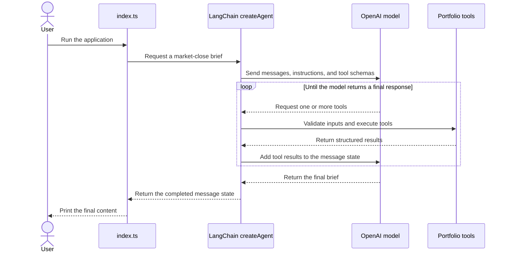

# Agent Runtime

This page describes one portfolio-briefing run. It focuses on orchestration rather than the internal details of individual tools.

## Execution Flow

The diagram uses a loop because the model controls tool-call order. The system prompt requires the current portfolio tools, but the architecture does not depend on one hard-coded sequence.

## Runtime Responsibilities

| Component | Responsibility |
| --- | --- |
| `src/index.ts` | Loads environment variables, sends the user intent, receives agent state, and prints the final message. |
| `src/agents/portfolioBriefAgent.ts` | Configures `ChatOpenAI`, the system prompt, safety rules, and the tool collection. |
| LangChain `createAgent` | Builds and runs the model-tool loop and maintains messages during one invocation. |
| OpenAI model | Chooses tool calls from their schemas and turns returned facts into the final brief. |
| Portfolio tools | Validate model-generated arguments and return structured portfolio facts. |

## LangGraph Boundary

LangChain's `createAgent` uses a LangGraph state graph internally. The project therefore uses LangGraph for the current agent loop without defining graph nodes and edges directly.

A later curriculum step will replace this implicit loop with an explicit project-owned graph when typed state, fixed workflow stages, retries, or conditional routing have a concrete purpose.

## Current State And Output

- Message state exists only for the current invocation.
- There is no checkpointer or persistent conversational memory.
- The CLI currently prints the model's final message content.
- A runtime `PortfolioBrief` Zod schema is under development but is not yet wired into `createAgent` structured output.
- LangSmith tracing and evaluation have not yet been added.
