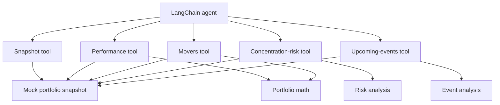

# Tool Layer

This page describes the capabilities exposed to the model and the deterministic code behind them.

## Tool Dependencies

## Tool Contracts

| Tool | Model input | Structured output | Deterministic dependency |
| --- | --- | --- | --- |
| `get_portfolio_snapshot` | None | `PortfolioSnapshot` | Mock portfolio data |
| `get_portfolio_performance` | None | `PortfolioPerformance` | Portfolio math |
| `get_portfolio_movers` | Optional `limit`, default `3` | `HoldingMover[]` | Portfolio math |
| `get_portfolio_concentration_risks` | Optional `threshold`, default `0.25` | `RiskSignal[]` | Risk analysis |
| `get_upcoming_portfolio_events` | Optional `limit`, default `5` | `MarketEvent[]` | Event analysis |

Tool descriptions tell the model when a capability is appropriate. Zod input schemas constrain model-generated arguments before the wrapped TypeScript function runs.

## Files And Responsibilities

| File | Responsibility |
| --- | --- |
| `src/tools/getPortfolioSnapshot.ts` | Returns raw holdings, prices, cash, and events. |
| `src/tools/getPortfolioPerformance.ts` | Returns trusted totals and daily performance. |
| `src/tools/getPortfolioMovers.ts` | Returns bounded, ranked daily movers. |
| `src/tools/getPortfolioConcentrationRisks.ts` | Returns concentration signals using a configurable portfolio-weight threshold. |
| `src/tools/getUpcomingPortfolioEvents.ts` | Returns bounded events sorted from the snapshot time onward. |
| `src/analysis/portfolioMath.ts` | Calculates holding values, portfolio performance, and movers. |
| `src/analysis/portfolioRisk.ts` | Calculates, classifies, and ranks concentration risks. |
| `src/analysis/portfolioEvents.ts` | Validates event dates, removes past events, sorts, and limits results. |
| `src/data/mockPortfolio.ts` | Provides the immutable fictional snapshot used by all local tools. |
| `src/domain/portfolio.ts` | Defines the provider-neutral TypeScript contracts shared by tools and analysis. |
| `src/tools/portfolioTools.test.ts` | Directly tests tool names, defaults, explicit inputs, structured returns, and schema rejection. |

## Data Consistency Limitation

Each tool currently imports the same mock snapshot independently. Because that object is immutable, every tool sees consistent data during local development.

When a live provider or MCP server replaces the mock, the system must obtain one consistent snapshot per briefing run. Tools should receive that shared snapshot or use a provider contract that guarantees the same snapshot version across calls.

## Safety Boundary

All current tools are read-only. They retrieve or analyze portfolio data and cannot place trades, modify brokerage data, or send notifications.
